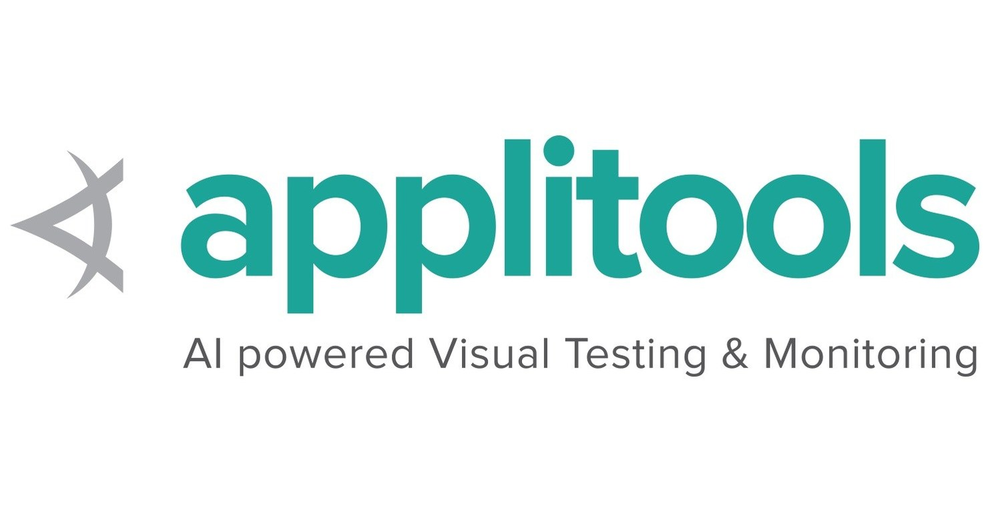

<p align="center">
    
  <h3 align="center">Applitools Visual AI Rockstar Hackathon</h3>
  <p align="center">Automated test suite for demo app using Applitools.</p>
</p>

<!-- TABLE OF CONTENTS -->

## Table of Contents

- [About the Project](#about-the-project)
- [Getting Started](#getting-started)
  - [Prerequisites](#prerequisites)
  - [Installation](#installation)
- [Usage](#usage)
- [License](#license)
- [Contact](#contact)

<!-- ABOUT THE PROJECT -->

## About The Project

[![Product Name Screen Shot][product-screenshot]](https://example.com)

Here's a blank template to get started:
**To avoid retyping too much info. Do a search and replace with your text editor for the following:**
`gavin771`, `repo`

<!-- GETTING STARTED -->

## Getting Started

To get a local copy up and running follow these simple steps.

### Prerequisites

This is an example of how to list things you need to use the software and how to install them.

- npm v10.14.1+
- Java v10.0.1+

### Installation

1. Clone the repo

```sh
git clone https://github.com/gavin771/repo.git
```

2. Install NPM packages

```sh
npm install
```

3. Test scripts
```sh
# Runs traditional tests against v1 of the app
npm run v1_traditional_tests
```

<!-- USAGE EXAMPLES -->

## Usage

Use this space to show useful examples of how a project can be used. Additional screenshots, code examples and demos work well in this space. You may also link to more resources.

_For more examples, please refer to the [Documentation](https://example.com)_

<!-- LICENSE -->

## License

Distributed under the MIT License.

<!-- CONTACT -->

## Contact

Gavin Samuels - [@gavin_io](https://twitter.com/gavin_io)<br/>
Project Link: [https://github.com/gavin771/repo](https://github.com/gavin771/repo)
